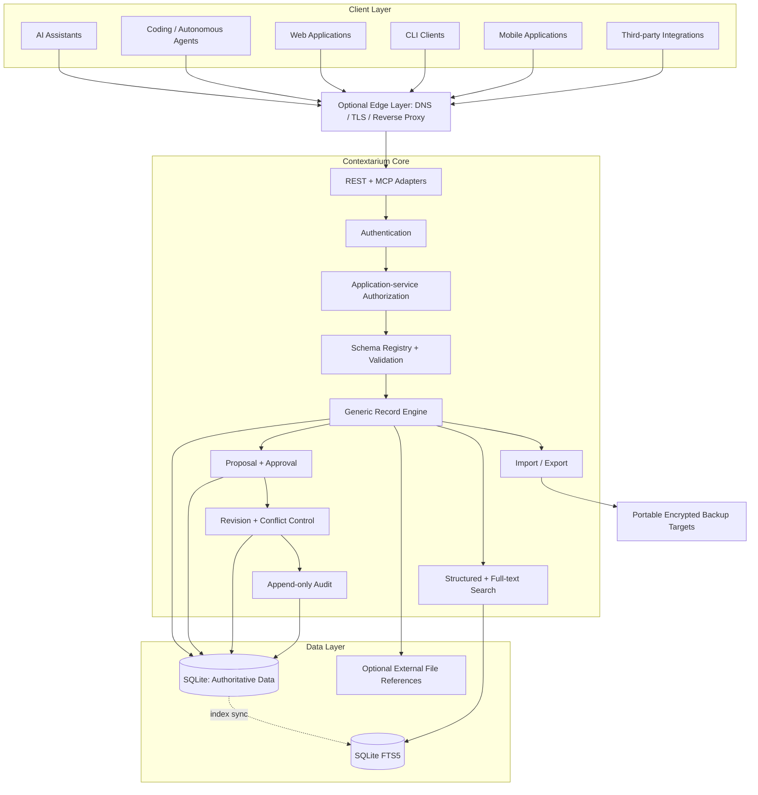

# Architecture

Contextarium v0.1 is a **modular monolith**: logical components are separated in code, but deployed as one application process backed by one SQLite database.



## Boundaries

REST, MCP, CLI, and future adapters call the same application-service layer. Protocol-specific structures must not become the domain model.

**Authorization is enforced by application services for every protected operation.** Adapters establish authenticated request context and translate protocol requests; storage is not an alternate authorized entry point. This prevents a future MCP or administrative adapter from bypassing rules enforced only in REST middleware.

SQLite is authoritative. FTS5 is derived and rebuildable.

v0.1 treats attachments as external references only. Managed attachment bytes are outside the v0.1 baseline until a milestone explicitly defines integrity, authorization, lifecycle, and recovery behavior.

## Write path

Agent clients should default to:

```text
read -> propose -> validate -> authorize -> revision check
     -> approve -> new revision -> current state -> audit
```

For revision-bearing accepted mutations, the revision predicate, immutable revision, current record state, and required mutation audit event are committed in one SQLite transaction.

## Historical access

Record subject and namespace are immutable in v0.1. Historical revisions therefore use the same subject/namespace authorization boundary as the current record, plus the scope required to read revisions.

Sensitivity labels are descriptive metadata in v0.1 and are **not** a security boundary.

## Deployment

The core must not require Cloudflare, GitHub, Docker, Kubernetes, or a particular VPS provider.

An edge layer is optional for local-only use. If authenticated traffic crosses an untrusted network, encrypted transport is mandatory, whether provided by a reverse proxy, private tunnel, or server deployment.

Markdown is an export/view format, not an authoritative database.

See [baseline-invariants.md](baseline-invariants.md) for milestone release gates and cross-cutting invariants.
